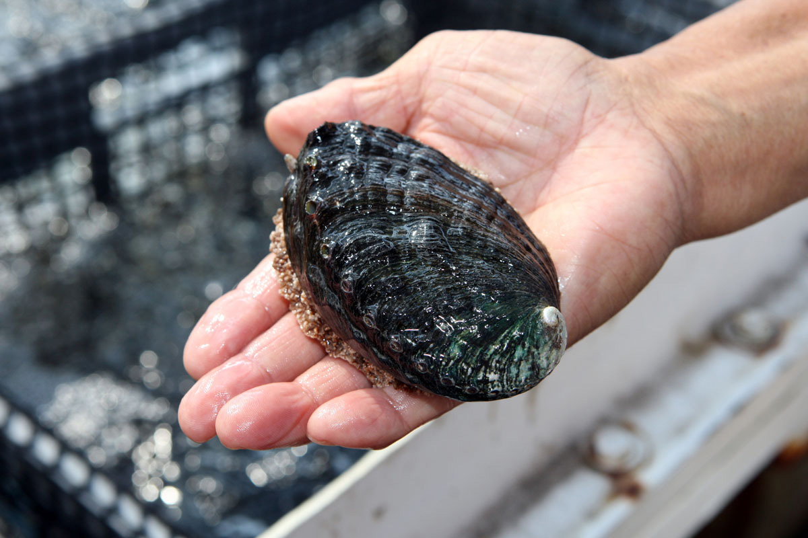

# Abalone project

In this project I will try to solve following problem:
> _"Currently biological scientists determine age of abalones counting the number of rings in its' shell with a microscope. At first, they have to open every abalone, use some chemicals and wait when the rings will be visible. So, this is a time consuming process, which involves additional costs (chemicals, pipette tips etc.). To improve process of determining abalones' age try to find another method using collected data."_

Data used in this project you can find [here](https://www.kaggle.com/rodolfomendes/abalone-dataset).

This project contains following steps:
* I will look into the data 
* data cleaning _(almost nothing, this dataset was already prepared :) )_ 
* I will create few machine learning classifiers _(in progress)_

_Code written in **Python**._

**Are you courios what abalone is?**  
Abalone is a common name for any of a group of small to very large sea snails, marine gastropod molluscs in the family _Haliotidae_.
If you want to read more you find more informations on [Wikipedia](https://en.wikipedia.org/wiki/Abalone).  

If you want to buy abalone steaks for **only $30.00 per EACH** and eat, you can do this [here](https://www.giovannisfishmarket.com/seafood-online/abalone.aspx)! Enjoy!
